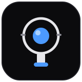

<div align="center">



<h1>Find X9 Ultra Tele Camera</h1>

<p><b>Professional camera app for OPPO Find X9 Ultra</b><br/>
3x periscope telephoto + afocal teleconverter (300mm) · full manual control · afocal 180° flip · gyro EIS</p>

<p>


</p>

</div>

## Features

- **Single-device exclusive**: Android 16 (API 36), latest toolchain only (no backward compatibility).
- **Afocal 180° flip**: The teleconverter is afocal, so images are flipped 180° on input → preview/photos/videos all corrected.
- **Full manual control**: Focus (fine-tuning near infinity), ISO, shutter, WB, EV. Stop-snapping dials with haptic detents for exposure controls.
- **Tap-to-focus**: Region-based autofocus that locks on the tapped point until focus mode changes.
- **Device-orientation-aware capture**: Stills save upright in any phone hold (portrait/landscape/tilted), thanks to gyro-derived gravity orientation.
- **Photos**: HEIF + JPEG + RAW (DNG) formats selectable. HEIF/JPEG with 180° pixel rotation; DNG with EXIF orientation tag.
- **Video**: 10-bit HEVC (Main10, Rec.2020, HLG / Log); 8-bit AVC (H.264, SDR); AV1 software-only. Resolutions up to 8K; frame rates include 24/25/30/60 fps, drop-frame (23.976/29.97/59.94), and 120 fps high-speed. Exact bitrate displayed in Mbps. Open-Gate (full 4:3 sensor) recording. Audio AAC, ~128 kbps.
- **Aspect ratios**: 4:3 (full sensor, no crop) and 16:9 (center crop).
- **Settings persistence**: Pro controls and manual settings saved across app launches (toggle: "Remember Settings", default ON).
- **Capture aids**: Focus peaking, zebra, grid, spirit level, punch-in zoom, histogram, waveform monitor.

## Toolchain

See [`CLAUDE.md`](CLAUDE.md) § **Toolchain** for pinned versions and build setup.

| Component | Version |
|---|---|
| AGP | 9.2.0 (Kotlin 2.3.10 built-in) |
| Gradle | 9.6.1 |
| Compose BOM | 2026.06.00 |
| compileSdk / targetSdk / minSdk | 37 / 36 / 36 |
| JDK | 21 (aarch64) |

> compileSdk 37 satisfies the latest AndroidX (lifecycle 2.11.0); targetSdk/minSdk 36 target Android 16. AGP 9 has Kotlin built-in; the `kotlin.android` plugin is not applied.

## Build

```bash
./gradlew assembleDebug        # debug APK
./gradlew installDebug          # install to device
```

Requires JDK 21 + Android SDK (API 36, build-tools 36.0.0). Design document: [`docs/superpowers/specs/2026-07-01-find-x9-ultra-camera-design.md`](docs/superpowers/specs/2026-07-01-find-x9-ultra-camera-design.md)

## Implementation Status

Complete scaffold + core implementation (Camera2 tele selection & manual control, GL 180° flip preview/encoder, HEIF+DNG+JPEG photos, device-orientation-aware capture, HEVC/AVC/AV1 video with runtime codec detection, settings persistence, Compose pro UI with stop-snapping exposure dials and tap-to-focus).

- ✅ **Build**: `./gradlew assembleDebug :app:testDebugUnitTest` passes. APK builds successfully.
- ✅ **Unit tests**: FocusMappingTest, RotationMathTest, CameraSelector2Test, VideoCapabilitiesTest pass.
- ⏳ **On-device verification**: Manual focus, RAW/DNG, 10-bit HDR preview, tap-to-focus, device-orientation auto-rotate, video codec detection, and settings persistence require on-device testing on actual Find X9 Ultra tele lens.
- ⏳ **Tuning**: EIS gain scaling, gyro axis calibration, LOG curve tonality, and Dolby Vision support (if present) need device verification.
