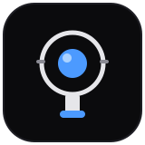

<div align="center">



<h1>TeleCam Pro</h1>

<p><b>Manual camera for periscope telephoto phones and clip-on afocal teleconverters</b></p>

<p>


</p>

</div>

A clip-on afocal teleconverter turns a phone's periscope lens into a long telephoto — and breaks two
assumptions every stock camera app makes. The image arrives **upside down**, because an afocal
telescope has no erecting prism. And the light leaves it **collimated**, so the phone focuses near
infinity and autofocus has almost nothing to work with.

TeleCam Pro is built around those two facts, then filled out with the manual controls that kind of
shooting needs.

## Features

**Teleconverter**
- Afocal 180° flip corrected everywhere — preview, stills, and video.
- Tell the app which converter you mounted: pick your phone, then the optics that clamp onto it.
  Presets cover the Hasselblad 300 mm and 230 mm, ZEISS 200 mm and 400 mm, generic 1.5/2/3× clip-ons,
  and a custom magnification. Passive glass cannot identify itself, so this is a declaration — only
  the *phone* is detected.
- Each preset's magnification is derived from the tele lens it was designed for, so a converter used
  on a different body reports its true focal length instead of the number printed on the barrel.
- With TELE engaged the focal rail becomes a digital-zoom picker whose marks come from the lens's
  advertised range × your converter. Marks the optics cannot reach are absent, not clamped.

**Manual control**
- PASM-style exposure, plus manual focus on a nonlinear slider that spends most of its travel near
  infinity — where a collimated converter actually focuses.
- ISO, shutter (speed or cine angle), WB presets + Kelvin/tint, EV, metering, and drive modes
  (single / burst / AEB / timelapse), with stop-snapping haptic detents.
- Every control is normalized to what the selected camera actually advertises; a value the hardware
  cannot apply is not offered.

**Capture**
- HEIF and JPEG, selectable separately or together. RAW (DNG) is available in TELE mode, where the
  app routes to a standalone camera that permits it.
- Video: HEVC/AVC up to 4K UHD, 24/25/30/60 fps plus NTSC drop-frame, bitrate presets to ~120 Mbps,
  Open Gate 4:3, AAC 48 kHz stereo.
- Colour profiles for HLG, S-Log3, S-Log3.Cine and LogC3 — see the honesty note below.
- Video stabilization uses the device's own OIS + EIS path. At 300 mm, OIS is what cuts per-frame
  motion blur; frame-warping EIS cannot.

**Viewfinder**
- Sony-style: Fn, My Menu, MR banks, compact OSD. No tutorial banners or coach marks over the image
  ([UX policy](docs/UX_POLICY.md)).
- Focus peaking, zebra, false colour, grid, spirit level, histogram, waveform.
- A movable punch-in loupe, with an optional corner overview that marks the magnified field.
- Pinch-to-zoom review of the last shot, in app.

**Reliability**
- Settings persist across launches, with separate toggles for keeping your lens and TELE choice.
- A capture followed immediately by an app kill still finalizes. A finished file whose MediaStore
  publish fails is adopted and published at the next launch rather than discarded.
- A microphone failure mid-recording degrades the clip to video-only instead of losing the take.

## What this app does not claim

The Camera2 stream it receives is the ISP's **display-referred 8-bit SDR** output.

That has a consequence worth stating plainly: **the log and HLG profiles are curves baked onto that
SDR signal, not scene-referred camera log.** They decode BT.1886, matrix to the target gamut, and
apply the S-Log3 / LogC3 / HLG transfer function. They give you a flat image that drops into a
log grading workflow — they do **not** recover highlights the ISP has already tone-mapped away, and
they do not extend dynamic range. Neither HLG nor the log profiles are end-to-end 10-bit capture.

A genuinely scene-referred stream would need the vendor's authenticated camera SDK. The device's
native log key is accepted by the HAL but changes nothing a third-party app can see — tested on
device with both preview and record templates.

> S-Log is a trademark of Sony Group Corporation; LogC is a trademark of ARRI. The profiles are this
> app's own implementations of the published curve specifications, named to describe grading-workflow
> compatibility.

## Device support

Requires **Android 16 (API 36)**. Hardware is resolved by enumerating Camera2 capabilities rather
than by model name, so the app adapts to whatever lenses and controls a phone advertises.

Development and device verification happen on the **OPPO Find X9 Ultra**, which is also where the
HAL workarounds in [`CLAUDE.md`](CLAUDE.md) were measured. Other Android 16 phones are supported on a
best-effort basis.

## Build

```bash
./gradlew assembleDebug        # debug APK
./gradlew installDebug         # install to a connected device
```

Requires JDK 21, Android SDK Platform 37, and Build Tools 36.0.0. Platform 37 is a compile-time
requirement only; the runtime target and minimum stay API 36. AGP 9 bundles Kotlin, so the
`kotlin.android` plugin is not applied.

| Component | Version |
|---|---|
| AGP | 9.3.0 |
| Gradle | 9.6.1 |
| Kotlin / Compose compiler | 2.4.10 |
| Compose BOM | 2026.06.01 |
| compileSdk / targetSdk / minSdk | 37 / 36 / 36 |
| JDK | 21 |

The Gradle wrapper is pinned to its published SHA-256, and resolved plugins and dependencies are
checked against `gradle/verification-metadata.xml` in strict mode.

### Release builds

`./gradlew bundleRelease` produces the Play App Bundle. Signing is driven by a gitignored
`keystore.properties` plus `TELECAMPRO_STORE_PASSWORD` / `TELECAMPRO_KEY_PASSWORD` in the
environment — no keys live in git, and release bundling fails fast rather than emitting an unsigned
artifact. R8/minify is off for v1.

## Open source

No ads, analytics, in-app purchases, accounts, or cloud sync. Source at
[`github.com/hletrd/telecam-pro`](https://github.com/hletrd/telecam-pro).

## Documentation

| | |
|---|---|
| [`docs/ARCHITECTURE.md`](docs/ARCHITECTURE.md) | As-built design authority: module map, threading, ownership, data flow |
| [`CLAUDE.md`](CLAUDE.md) | Hard-won device and HAL facts, and the conventions that follow from them |
| [`docs/BACKLOG.md`](docs/BACKLOG.md) | Release board, residual field checks, deferred work |
| [`docs/FIELD_CHECKS.md`](docs/FIELD_CHECKS.md) | Hands-on device checks: setup, command, pass criteria |
| [`docs/TESTING.md`](docs/TESTING.md) | Test tiers and coverage policy |
| [`docs/UX_POLICY.md`](docs/UX_POLICY.md) | Viewfinder rules |

Store listing text, privacy policy, and Play assets live in
[`docs/play-store-listing.md`](docs/play-store-listing.md),
[`privacy-policy/`](privacy-policy/index.html), and [`docs/assets/play/`](docs/assets/play/).
